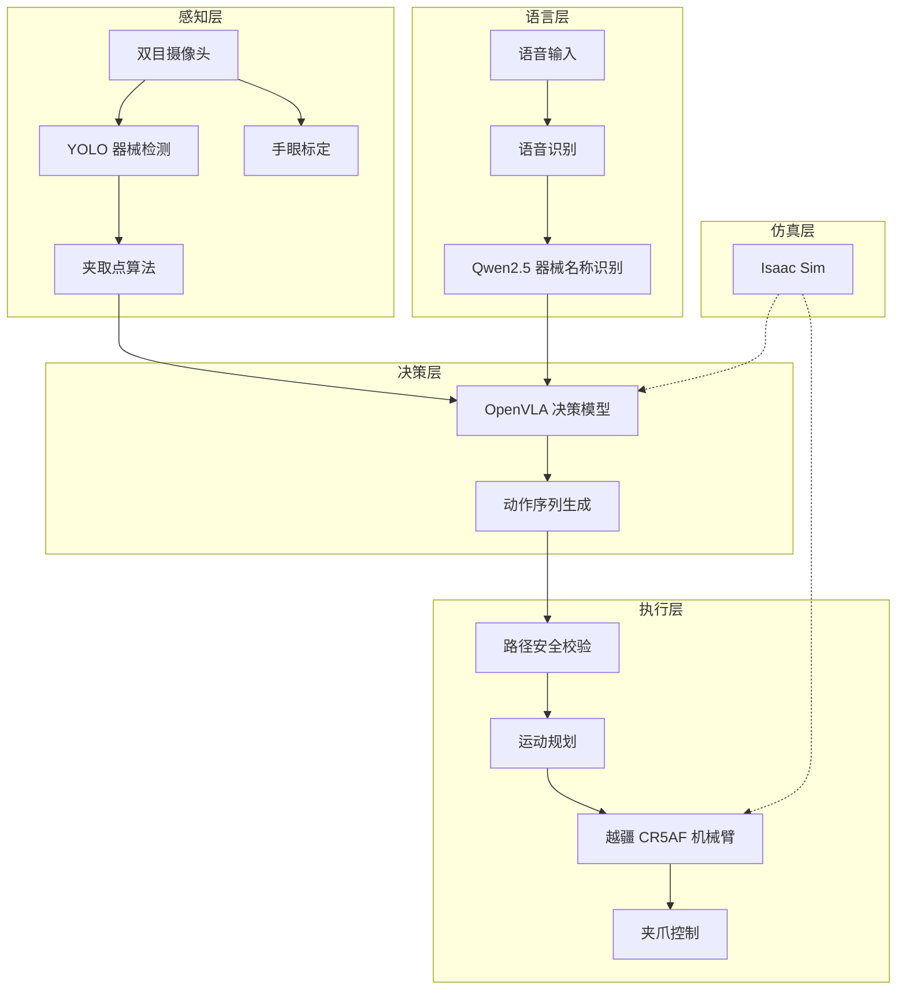
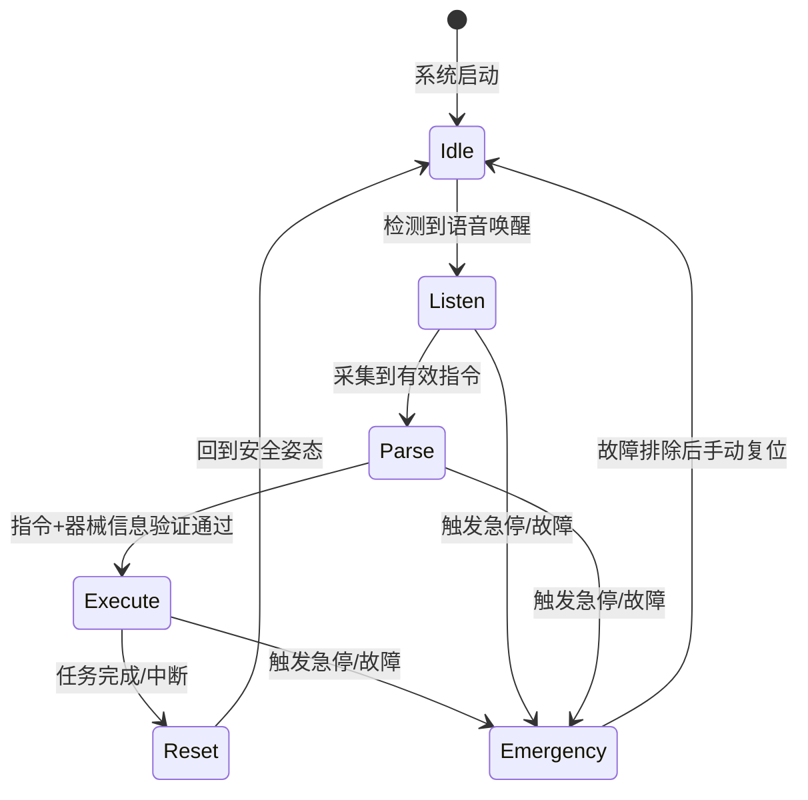

# 总体架构

## 系统分层

系统由五大模块组成，形成从感知到执行的完整闭环：



## 状态机

机械臂默认处于待机状态，只有收到有效指令才会动作，确保手术室安全。



## 程序结构

```
surgical_robot_cr5af/
├── hardware/               # 硬件驱动层（封装底层 SDK）
│   ├── cr5af_arm.py        # 机械臂 SDK 封装
│   ├── camera_driver.py    # 双目 / 3D 相机驱动
│   ├── microphone_driver.py
│   ├── gripper_driver.py
│   └── hand_eye_calib.py   # 手眼标定（半自动化开发中）
├── modules/                # 功能模块层
│   ├── perception/         # 感知模块
│   ├── nlp/                # NLP 模块
│   ├── decision/           # 决策模块
│   ├── execution/          # 执行模块
│   └── simulation/         # 仿真模块
├── core/                   # 核心控制层
│   ├── state_machine.py    # 状态机
│   ├── config.py           # 全局配置（含场景模式参数）
│   ├── logger.py
│   └── safety_manager.py   # 安全管理（执行前校验、急停）
├── tests/
└── main.py
```

## 通信协议

| 接口 | 方式 | 数据格式 |
|------|------|----------|
| 摄像头 → 感知 | USB / GigE | RGB-D 图像流 |
| 感知 → 决策 | Python API | `GraspTarget` |
| NLP → 决策 | Python API | `InstrumentCommand` |
| 决策 → 执行 | Python API | `ActionSequence` |
| 执行 → 机械臂 | Dobot SDK（TCP） | 关节角 / 末端位姿 |

完整接口定义见 [模块接口定义](module_interfaces.md)。

<div class="doc-footer">
  <span>负责人：任松（架构设计）</span>
  <span>最近更新 2026-03-18</span>
</div>
