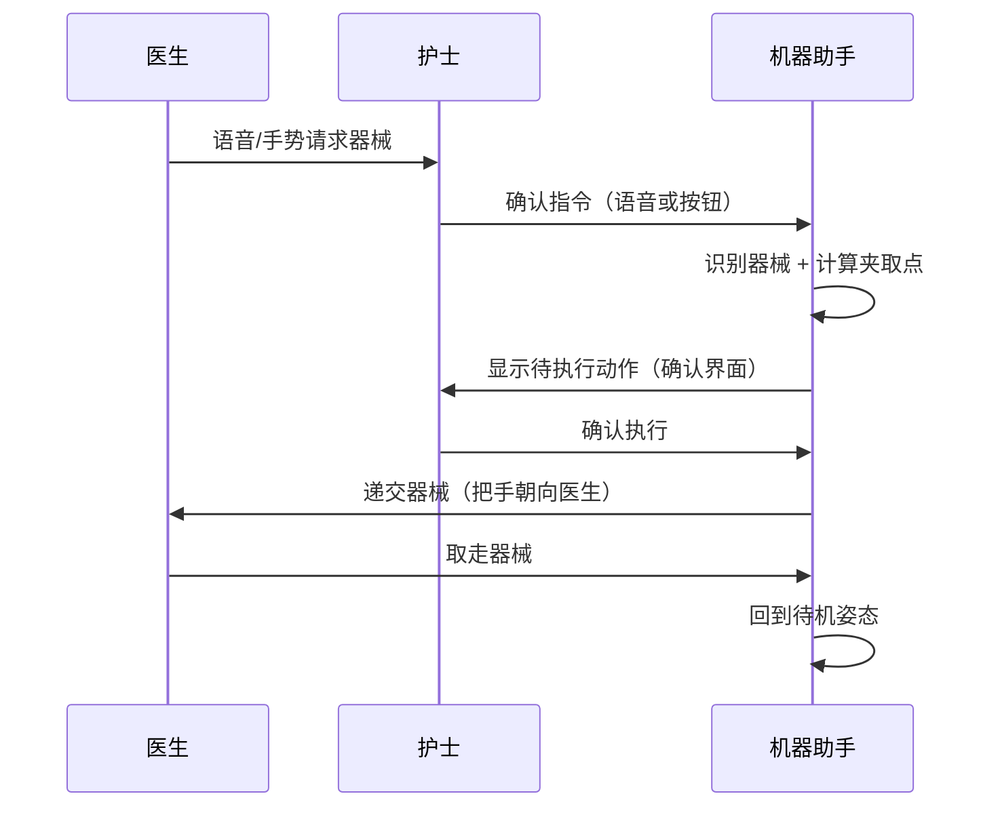

# 人机协同方案

## 核心原则

**机器助手是辅助，护士是决策者。**

系统不追求完全自动化，而是处理约 **70–80% 的高频标准器械递交任务**，将护士从重复性操作中解放出来，专注于复杂判断和异常处理。

## 工作流

## 护士保留权限

- **任何时刻可急停**：脚踏板或 GUI 急停按钮
- **拒绝执行**：确认界面可拒绝，机器助手不强制执行
- **异常接管**：识别失败、置信度不足时，系统主动提示护士手动处理
- **参数调整权**：通过 GUI 调整机械臂速度、力控参数

## 安全底线

详见 [全局安全约束](safety_constraints.md)。

  最近更新 2026-03-18

