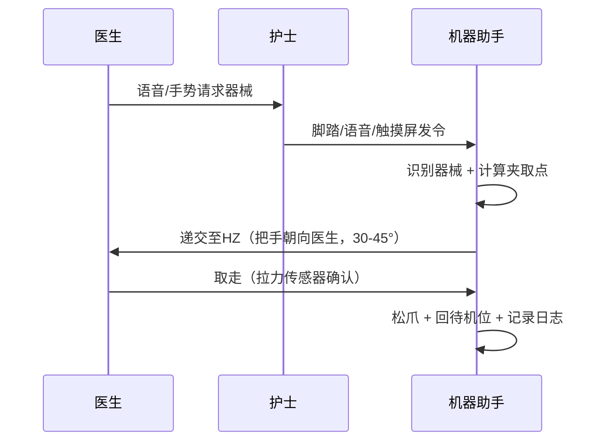

# 人机协同方案

## 核心原则

**机器助手是辅助，护士是决策者。**

系统不追求完全自动化，而是处理约 **70–80% 的高频标准器械递交任务**，将护士从重复性操作中解放出来，专注于复杂判断和异常处理。

---

## 器械护士岗位背景

> 本节基于实地调研与文献，用于明确机器人的替代边界。

### 工作阶段与核心动作

| 阶段 | 器械护士职责 | 机器人可介入点 |
|------|-------------|---------------|
| **术前** | 洗手穿衣、铺无菌台、按功能区摆放器械（持物区/切割区/缝合区）、清点基数 | — |
| **术中** | 精准传递器械（把手朝外）、口头报出器械名、与巡回护士三次清点 | 高频器械递交、计数留痕 |
| **术后** | 清点归还、分类清洗、打包送检、填写记录 | 辅助计数核对 |

### 器械传递规范（机器人须遵守）

- **姿态**：把手朝向主刀，刀尖/锐端远离医生
- **角度**：递交角度固定在 30–45°
- **等待**：在 Hand-off Zone（中立区）停留，直至医生/护士确认取走
- **口报**：语音播报器械名称（"持针器"、"组织剪"）

---

## 角色分工

| 角色 | 工位 | 职责 |
|------|------|------|
| **器械护士** | 手术床一侧 | 台面规划、特殊器械递交、异常决策、监督把关 |
| **机器助手** | 无菌台一侧（固定） | 识别器械、稳定抓取、精确递交、自动计数 |
| **协同点** | 中立交接区（HZ） | 护士触发指令，机器人执行并记录 |

---

## 三种配合模式

### 模式一：触发–执行（主导）

### 模式二：序列预测–确认（增强型）

机器人基于手术阶段预测下一件高频器械（如缝合阶段 → 持针器 + 缝针），在屏幕/语音提示后，由护士确认或否决再执行。

### 模式三：异常接管（安全）

机器人动作超时、抓取失败或置信度不足时，自动退回安全位并塔灯提示，护士即时手动接管，手术节奏不中断。

---

## 双确认释放机制

器械递出需满足两个条件才松爪：

1. **触发侧**：脚踏开关或语音指令已确认
2. **接收侧**：拉力/握力传感器检测到医生握持

---

## 护士保留权限

- **任何时刻可急停**：脚踏板或 GUI 急停按钮，≤80 ms 响应
- **拒绝执行**：确认界面可否决，机器助手不强制执行
- **异常接管**：识别失败时系统主动提示护士手动处理
- **参数调整权**：通过 GUI 调整机械臂速度、力控参数
- **冗余保障**：机器人仅处理 Top-10 高频器械，其余仍由护士人工递交

---

## 协同价值

| 维度 | 效益 |
|------|------|
| 减负 | 护士减少弯腰伸手等重复动作，NASA-TLX 负荷目标降低 ≥30% |
| 提效 | 递交流程标准化，平均递交时延 ≤2.5 s |
| 安全 | 自动计数留痕，防止器械遗留体内 |
| 数据 | 记录器械使用序列，反哺流程优化与模型训练 |

## 安全底线

详见 [全局安全约束](safety_constraints.md)。

  最近更新 2026-03-18

