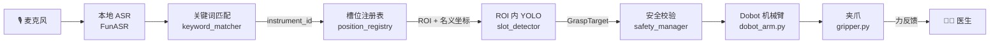

# 五一演示版冲刺计划

> **目标**：2026-05-01 前交付**全流程可交互演示版本**
> 可以只针对 4–6 种器械和若干指令，但流程必须端到端跑通。
> 策略：用**定制支架槽位**替代堆叠器械盘，大幅降低识别难度，快速建立可演示的闭环。

---

## 核心策略：槽位支架方案

### 原问题

```
器械随意堆叠 → YOLO 全图搜索 → 遮挡 / 误识别多 → 夹取失败
```

### MVP 解法

```
护士按类放入固定槽位
    ↓
相机只在对应 ROI 内确认 + 识别
    ↓
槽位先验坐标 + 视觉微调偏移 → 精确夹取点
    ↓
识别难度从"大海捞针"变成"在格子里认东西"
```

**三重简化叠加效果：**

| 维度 | 原方案 | 槽位方案 |
|------|--------|---------|
| 检测范围 | 全图搜索 | 已知 ROI，裁剪后识别 |
| 目标状态 | 随意堆叠，有遮挡 | 固定朝向，单件无遮挡 |
| 位置精度 | 完全依赖视觉 | 视觉 + 槽位先验兜底 |
| 置信度预期 | 经常 < 0.7 | 稳定 > 0.9 |

---

## 六周冲刺时间表

```
Week 1  2026-03-16 ~ 03-22
  ✅ core/ 骨架代码（config / interfaces / safety_manager / logger）
  ✅ 雄安测试问题归因完成
  □  position_registry.py 数据结构设计
  □  keyword_matcher.py 关键词→器械 映射

Week 2  03-23 ~ 03-29  【硬件对接周】
  □  hardware/dobot_arm.py  TCP 连接 + 基本运动封装
  □  hardware/gripper.py    夹爪 Modbus 封装 + 运行时参数注入
  □  上机标定各槽位名义坐标，写入 registry.json
  □  safety_manager 工作空间边界校验上线

Week 3  03-30 ~ 04-05  【感知 + NLP 周】
  □  slot_detector.py       ROI 裁剪 → YOLO 推理 → 夹取点修正
  □  Z 轴高度补偿（托盘平面标定）
  □  ASR 切换本地 FunASR（≤1s 延迟目标）
  □  keyword_matcher 联调测试

Week 4  04-06 ~ 04-12  【状态机集成周】
  □  core/state_machine.py  完整状态机串联
  □  决策层：rule_planner.py（纯规则，无 VLA）
  □  全流程第一次端到端跑通（允许有 bug）

Week 5  04-13 ~ 04-19  【联调稳定周】
  □  4 种器械 × 3 条指令完整场景测试
  □  夹取成功率 ≥ 85% 目标
  □  异常处理：低置信度提示、急停、力反馈释放

Week 6  04-20 ~ 04-30  【演示准备周】
  □  演示脚本定稿（器械配置一次即可用）
  □  参数配置界面（速度 / Z偏移 / 夹持力，不改代码）
  □  压力测试 + 边界情况修复
  □  文档 & 演示视频录制
```

---

## MVP 系统架构（简化版）



---

## 代码目录规划

```
surgbot/
├── core/
│   ├── config.py              ✅ 全局配置（速度/阈值/路径，外置不改代码）
│   ├── interfaces.py          ✅ GraspTarget / InstrumentCommand 数据类
│   ├── safety_manager.py      ✅ 工作空间边界校验 + 急停
│   └── logger.py              ✅ 结构化日志
│
├── hardware/
│   ├── dobot_arm.py           □ Dobot TCP 封装（Dashboard 29999 + 反馈 30005）
│   └── gripper.py             □ Modbus RTU 夹爪封装 + 4 器械力度预设
│
├── modules/
│   ├── perception/
│   │   ├── position_registry.py  □ 槽位注册表 JSON 读写
│   │   └── slot_detector.py      □ ROI 裁剪 + YOLO + 夹取点修正
│   ├── nlp/
│   │   ├── asr_local.py          □ FunASR 本地语音识别
│   │   └── keyword_matcher.py    □ 关键词 → instrument_id
│   └── decision/
│       └── rule_planner.py       □ 纯规则动作规划（不用 VLA）
│
├── core/
│   └── state_machine.py          □ 完整状态机串联
│
├── data/
│   └── instrument_registry.json  □ 槽位配置（上机标定后填写）
│
└── main.py                        □ 入口
```

图例：✅ 已完成 &emsp; □ 待开发

---

## 槽位注册表格式（草案）

```json
{
  "slots": {
    "slot_01": {
      "instrument_id": "INS-031",
      "name": "持针器_大",
      "aliases": ["持针器", "大持针器", "needle holder"],
      "grasp_point_nominal": [120.5, -30.2, 180.0],
      "grasp_orientation_deg": 45.0,
      "delivery_mode": "handle_to_doctor",
      "gripper_preset": 3,
      "roi_image": [120, 80, 320, 280],
      "camera_id": 0
    },
    "slot_02": {
      "instrument_id": "INS-007",
      "name": "剪刀",
      "aliases": ["剪刀", "scissors"],
      "grasp_point_nominal": [200.0, -30.2, 180.0],
      "grasp_orientation_deg": 0.0,
      "delivery_mode": "handle_to_doctor",
      "gripper_preset": 2,
      "roi_image": [330, 80, 530, 280],
      "camera_id": 0
    }
  },
  "calibration": {
    "z_plane_offset_mm": 0.0,
    "hand_eye_matrix": "data/hand_eye_latest.npy"
  }
}
```

> **配置一次即可复用**：支架位置固定后，`grasp_point_nominal` 只需标定一次。
> 更换器械种类只需更新 `name` / `aliases` / `gripper_preset` 三个字段。

---

## MVP 范围边界

**五一版本包含：**

- 4–6 种器械，每种对应一个槽位
- 语音指令：「递 XX」「把 XX 给我」「要 XX」
- 完整执行：抓取 → 递送 → 力反馈释放 → 回到待机姿态
- 参数配置文件（不改代码）
- 基本安全校验（工作空间边界）

**五一版本不包含（后续迭代）：**

- OpenVLA / VLA 决策模型
- 二维码扫描验证
- 多托盘 / 多摄像头切换
- Isaac Sim 仿真对接
- 器械归位回收

<div class="doc-footer">
  <span>负责人：任松</span>
  <span>最近更新 2026-03-18</span>
</div>
